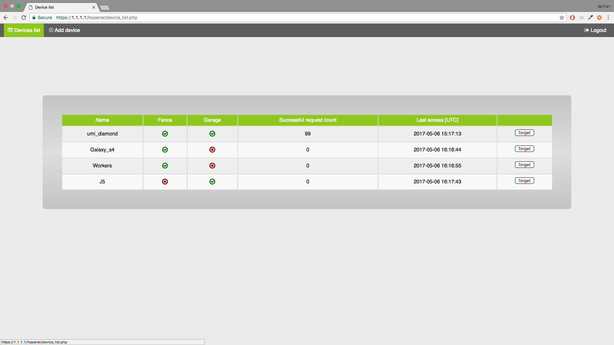
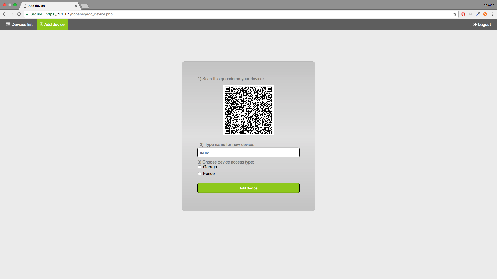
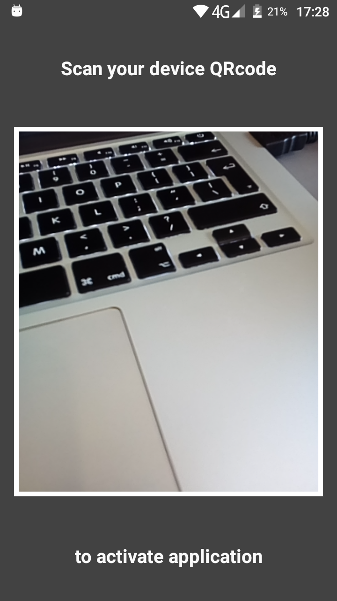
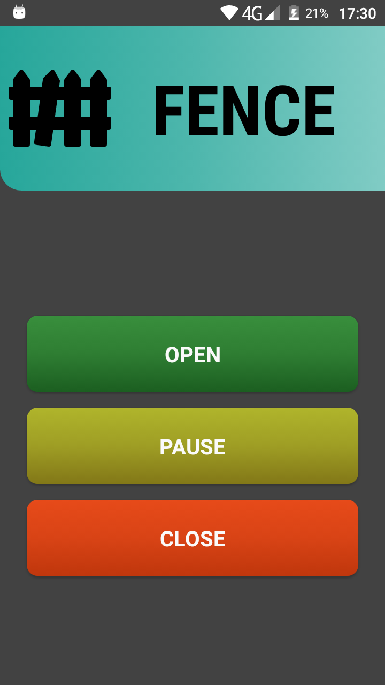
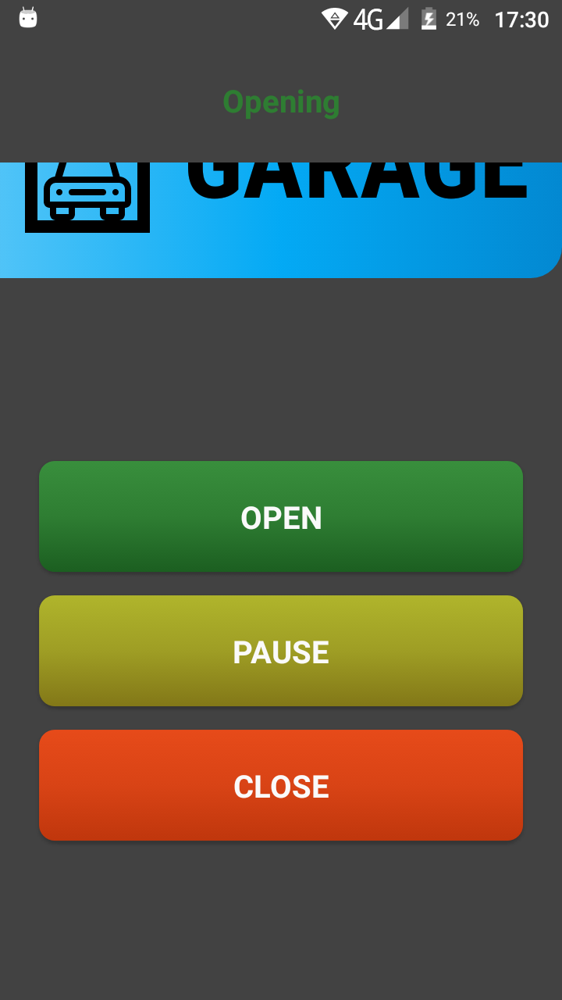
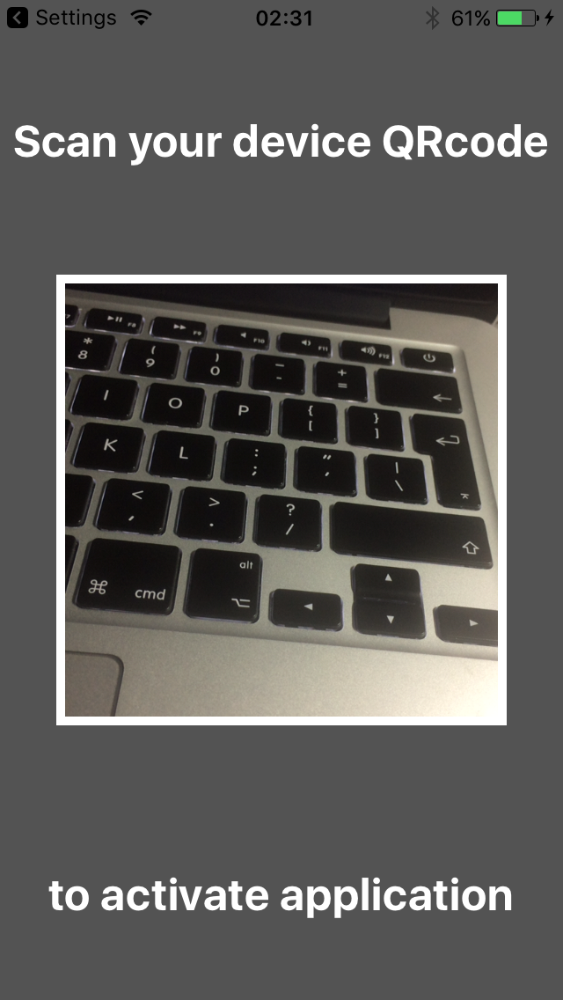
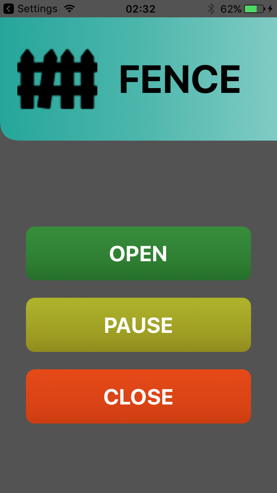
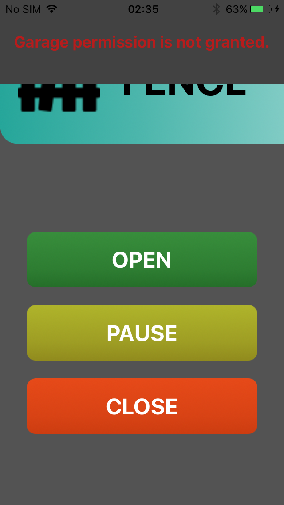
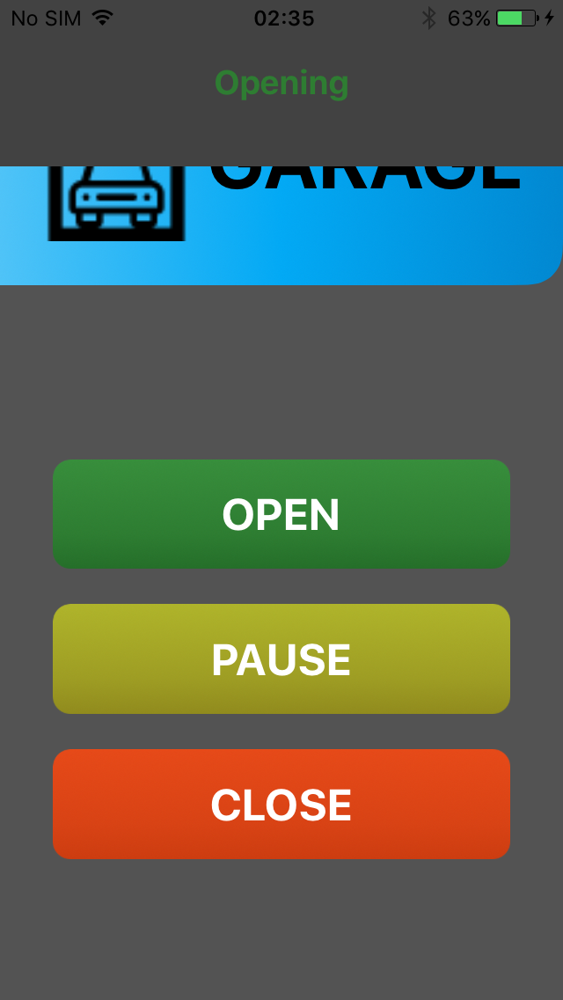
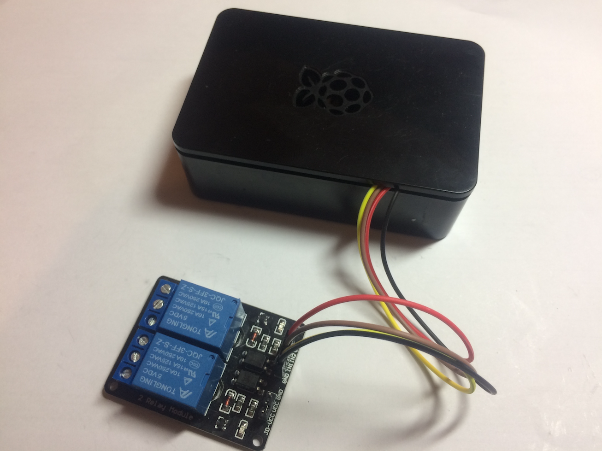

# Hopener

Hopener is small system that makes it possible to controll any automatic gate or garage door using Android/iOS mobile phone.
Youtube video:
 
 [](http://www.youtube.com/watch?v=bO3rsCuDZrI)
 
 
 Whole system can be divided into 3 parts:
* Web application ([Web](https://github.com/thirteendollars/hopener-web))
* Mobile application ([Android](https://github.com/thirteendollars/hopener-android), [iOS](https://github.com/thirteendollars/hopener-ios))
* Hardware

## Web application

Web application helps to manage all mobile devices that can access gate or garage door and provides simple API to communicate
with them. API specification is available in seperate [web](https://github.com/thirteendollars/hopener-web) project README file.

After successful login, "Devices list" tab is displayed, where all the devices having access to the system are listed.
There are some extra information, too.

You can add another device by clicking "Add device" tab.
Generated QRCode works as unique device id, 
that allows system to identify mobile phone when every request is sent. Before clicking "Add device", QRcode have to be 
scanned using mobile phone with dedicated mobile application installed on it.

<br>

What's more:
* Whole system communication is based on HTTPS protocol.
* All the vulnerable data as system password and devices' id are stored in database as hashed values.
* Used technologies: HTML,CSS,PHP,MySQL

## Mobile application
Using mobile phone application we are able to control gate or garage door remotly. When application is launched first time,
QRCode scanner is displayed in order to obtain unique id from Hopener system website. By swiping top slider it is possible
to change currently controlled home entrance. All the information are displayed in real time by automatically dropping down
notification window as shown on screenshots below.
<br><br>
<p align="middle"> Android version:</p>
<div align="middle" >


</div>
<div align="middle" >


</div>
<p align="middle"> iOS version:</p>
<div align="middle" >


</div>
<div align="middle" >


</div>

What's more:
* Whole system communication is based on HTTPS protocol.
* Vulnerable data such as device id are stored in SharedPreferences as encrypted values(Android) 
or in safe Keychain service (iOS).
* Used technologies: Java(Android), Swift(iOS)

## Hardware
Raspberry Pi 3 with [Raspbian OS](https://www.raspberrypi.org/downloads/raspbian/) and [NGINX](https://nginx.org/en/) 
server installed works as a main entrance controller. Communication with GPIO pins are served by [WiringPi](http://wiringpi.com/) 
library. Small 2-Relay module connected directly to Raspberry computer through GPIO pins allows to control fence and
garage door.



## Extra information
To clone whole project at once use recursive mode:
```
git clone --recursive git://github.com/thirteendollars/Hopener.git
```
